# 基于RAG与大模型技术的医疗问答系统
本项目使用的数据集来源于[Open-KG](http://data.openkg.cn/dataset/disease-information[)，参考了[RAGOnMedicalKG](https://github.com/liuhuanyong/RAGOnMedicalKG)、[QASystemOnMedicalKG](https://github.com/liuhuanyong/QASystemOnMedicalKG)

## 介绍
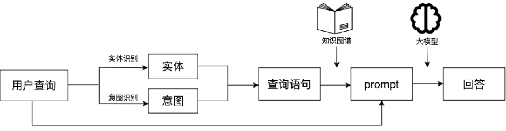
本项目设计了一个基于 RAG 与大模型技术的医疗问答系统，利用 DiseaseKG 数据集与 Neo4j 构建知识图谱，结合 Roberta 的命名实体识别和 34b 大模型的意图识别，通过精确的知识检索和问答生成，提升系统在医疗咨询中的性能，解决大模型在医疗领域应用的可靠性问题。

RAG技术：

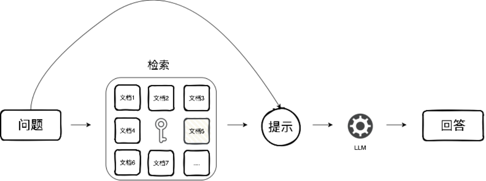

## :fire:To do
- [ ] NL2Cyhper
- [ ] 增加界面的功能

## Python环境配置
一个例子:

```
git clone https://github.com/honeyandme/RQGQnASystem.git
cd RQGQnASystem
conda create -n RQGQnASystem python=3.10
conda activate RQGQnASystem
pip install -r requirements.txt
```

## 构建知识图谱

首先需要安装Neo4j，[官方网站](https://neo4j.com/deployment-center/#community)。本项目使用的版本是neo4j-community-5.18.1，需要依赖jdk17。

安装并运行Neo4j后，我们需要根据```data/medical_new_2.json```数据集创建一个知识图谱。

```
python build_up_graph.py --website YourWebSite --user YourUserName --password YourPassWord --dbname YourDBName
```

其中，```--website```代表你的Neo4j网址，```--user```代表你的数据库用户名，```--password```代表你的数据库密码，```--dbname```代表你的数据库名字。

示例:

```
python build_up_graph.py --website http://localhost:7474 --user neo4j --password YourPassWord --dbname neo4j
```

运行```build_up_graph.py```后，会自动在```data```文件夹下创建```ent_aug```文件夹和```rel_aug.txt```文件，分别存放所有实体和关系。

创建的知识图谱如下图所示：

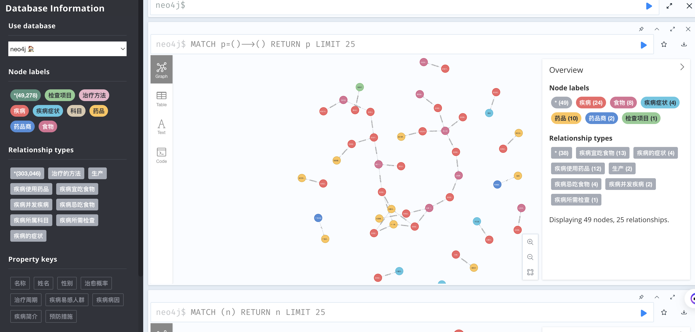

## 实体识别(NER)

什么是NER？

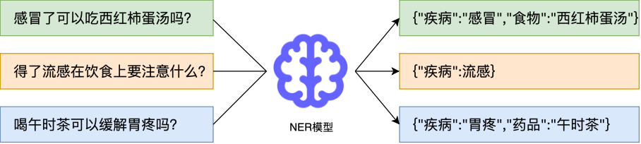


**<u>数据集创建：</u>**

你可以运行```ner_data.py```，这段代码会根据```data/medical_new_2.json```中的文字，结合规则匹配技术，创建一个NER数据集，保存在```data/ner_data_aug.txt```中。

我们已经上传了```ner_data_aug.txt```文件，您可以选择不运行```ner_data.py```。

注：我们采用BIO的策略对数据集进行标注，标注的结果如下图所示：

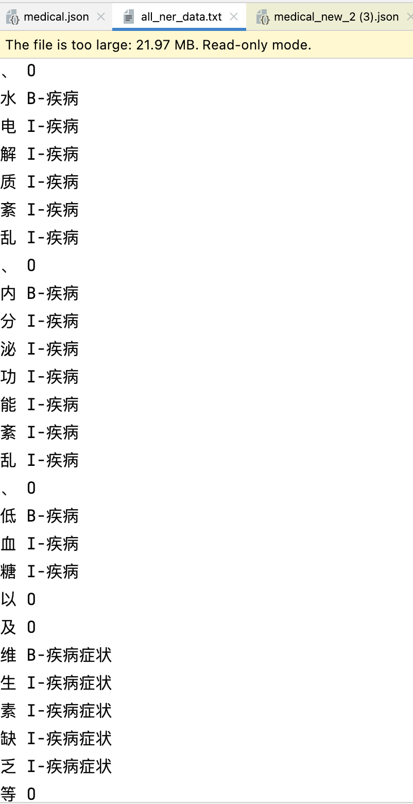

**<u>模型训练：</u>**

```ner_model.py``` 代码定义了NER模型的网络架构和训练方式。若您需要重新训练一个模型，请您在Huggingface上下载一个[chinese-roberta-wwm-ext](https://huggingface.co/hfl/chinese-roberta-wwm-ext)，并保存在```model```文件夹下，然后运行```ner_model.py``` 。

若您不想训练，可以[下载]()我们训练好的模型，并保存在```model```文件夹下。


我们的训练过程运用了实体替换、实体掩码、实体拼接三种数据增强策略，改进了模型的性能。

| 模型名称                | 未数据增强 | 数据增强 |
| ----------------------- | ---------- | -------- |
| bert-base-chinese       | 97.13%     | 97.42%   |
| chinese-roberta-wwm-ext | 96.77%     | 97.40%   |


## 意图识别

什么是意图识别？

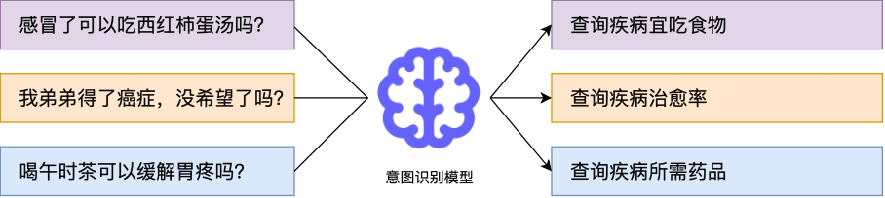

本项目的意图识别方案：直接设计Prompt，让大模型对用户的查询进行意图分析。我们结合了上下文学习和思维链技术，最终取得了良好的结果。

注：这部分代码整合到了```webui.py```中，您无需进行任何操作。

## 知识图谱查询


注：这部分代码整合到了```webui.py```中，您无需进行任何操作。

## 运行界面

我们将意图识别、知识库查询、对话界面都写在了```webui.py```中。您可以使用命令：

```
streamlit run webui.py
```

运行的界面如下图所示

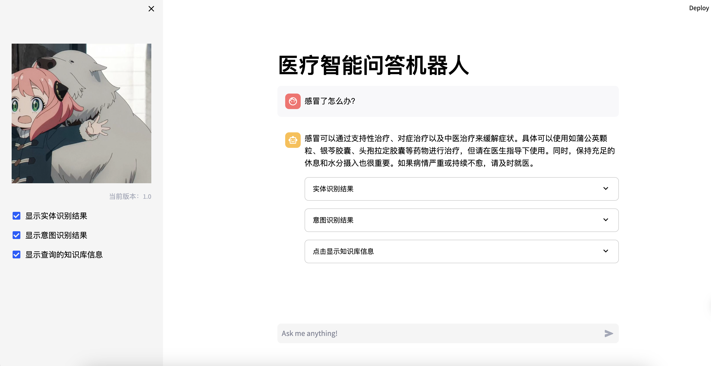

几个运行例子：

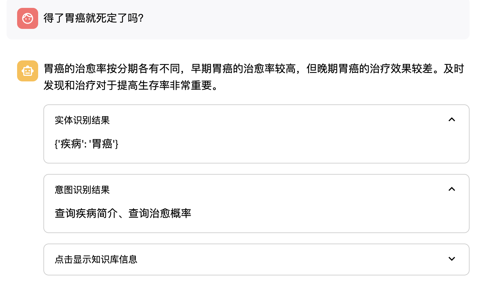

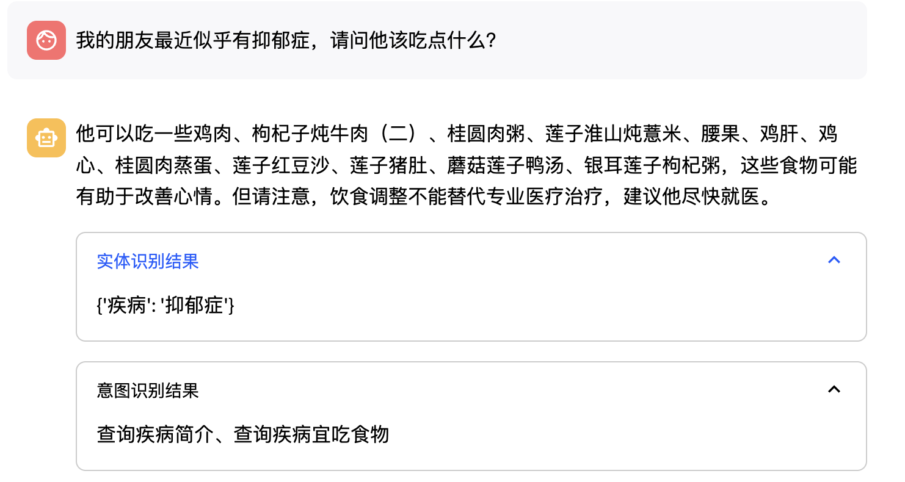

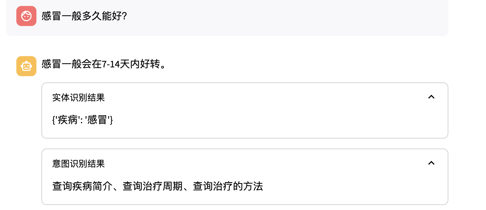

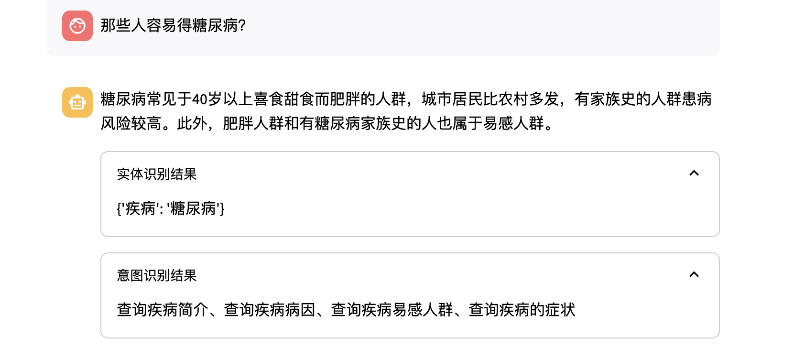


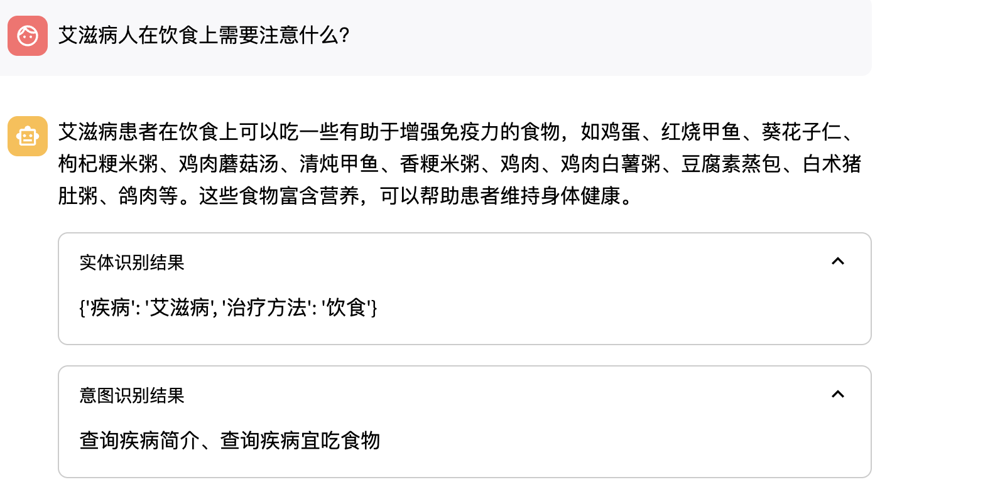

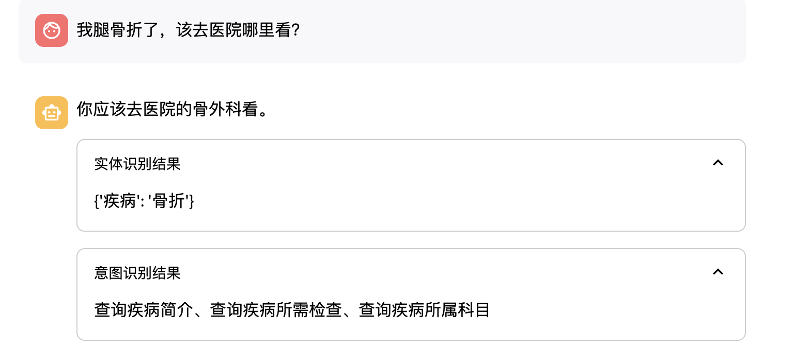
